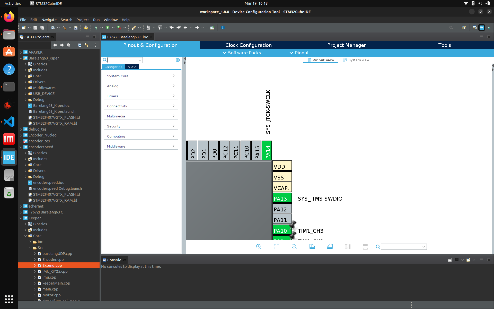

# Cara menghubungkan STM32 dengan ST-LINK

## Apa itu ST-LINK?
ST-LINK adalah debugger dan programmer yang digunakan untuk menghubungkan komputer dengan mikrokontroler STM32 atau STM8. Alat ini memungkinkan pemrograman firmware dan debugging secara real-time pada mikrokontroler STM.

## Wiring
Disini kita akan menggunakan Nucleo STM32 F767ZI sebagai contoh:

Koneksikan port ST-LINK ini dengan pin pada STM32 anda = 

RST <-> NRST

SWCLK <-> PA14

SWDIO<-> PA13

GND<-> GND

Terkhusus untuk daya, bisa memilih 3.3 v atau 5v dan koneksikan dengan v yang sama pada STM.

## Nyalakan SWDIO dan SWLCK pada IOC
Jangan lupa untuk menyalakan SWDIO dan SWLCK nya pada .ioc STM kamu agar nanti pinnya terinisialisasi dengan benar.

setelah kamu menyalakan SWDIO dan SWCLK nya, kamu bisa generate code.

## Koneksikan ST-LINK ke PC/Laptop
Langkah selanjutnya kamu hanya tinggal mencoba mendebug/mengupload melalui ST-LINK.