# Cara debug STM32

## Cara membaca data input/sensor pada STM32

1. Pertama, koneksikan ST-LINK STM32 anda dengan PC/Laptop anda.
2. Untuk board Nucleo-F767ZI STM32, memiliki ST-LINK internal sendiri jadi kita disini tinggal mengkoneksikan boardnya ke-PC lewat ST-LINK nya.
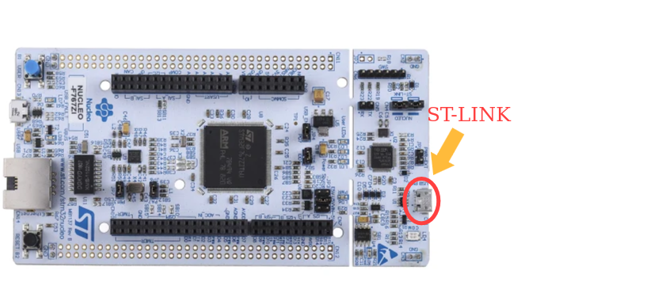
STM32 F407-DISC juga memiliki ST-LINK internalnya sendiri 
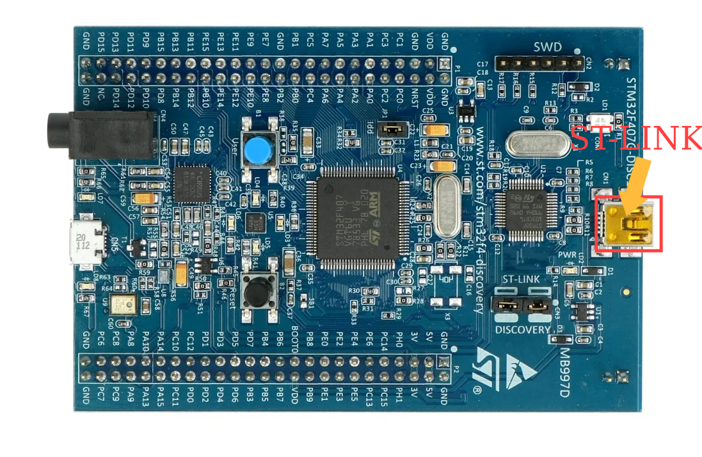
3. Jika tidak menggunakan ST-LINK internal dikarenakan rusak atau tidak ada, bisa menggunakan ST-LINK external. Bisa dilihat caranya [disini](ST-LINK.md)
4. Disini sebagai contoh kita akan membaca input dari button yang ada pada STM-nya. Seperti biasa, buatlah projek STM32 baru sesuai dengan board STM32 yang digunakan,
disini saya menggunakan STM32 F407-DISC.
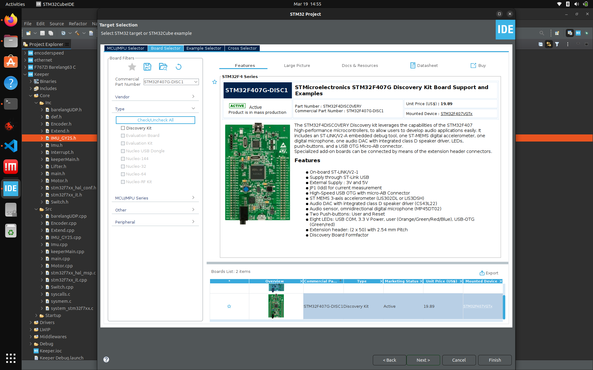
5. Lalu lihatlah pin Pushbutton yang ada pada STM yang anda gunakan pada file .ioc nya, seperti contoh disini pin Pushbutton saya berada pada PA0
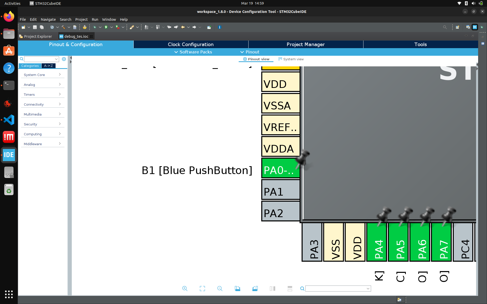
6. Pergi ke file main.c nya, dan buatlah variable untuk menyimpan input dari button, bisa menggunakan int atau bool. Disini saya membuat nama variablenya 'Tes'
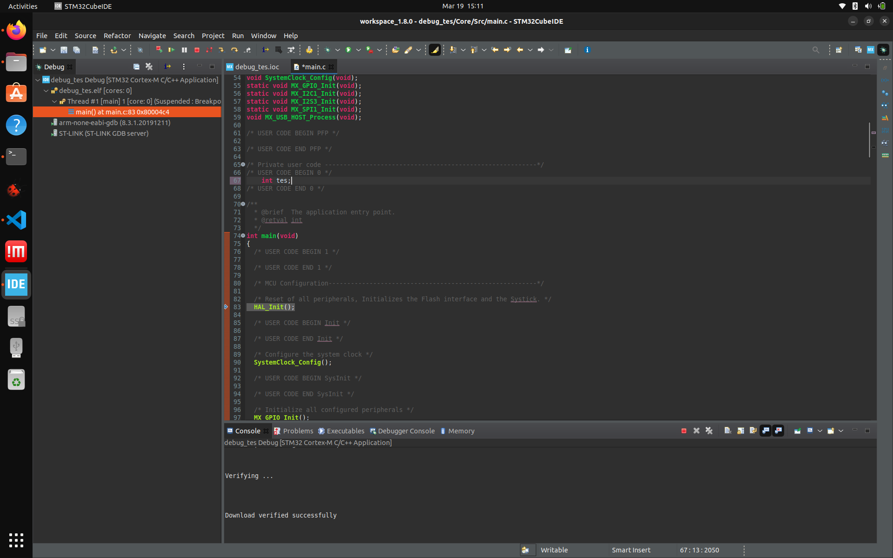
7. Pada loop-nya (disini while), buat fungsi readnya. Karena disini pin pushbuttonnya PA0, artinya port nya A dan pin-nya 1.
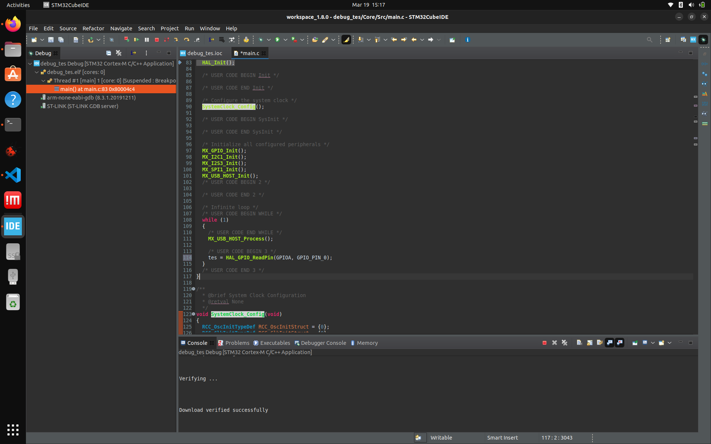
8. Lalu klik tombol debug (ber-logo kumbang), dan klik ok
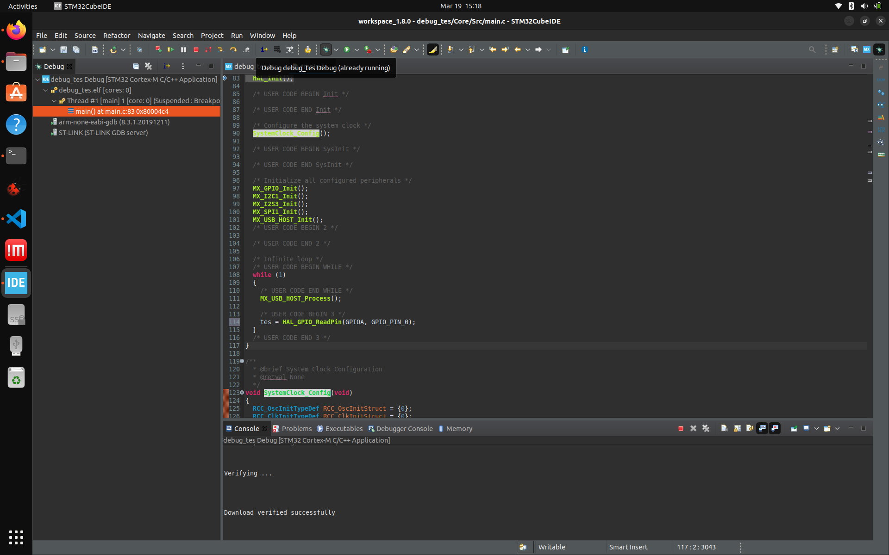
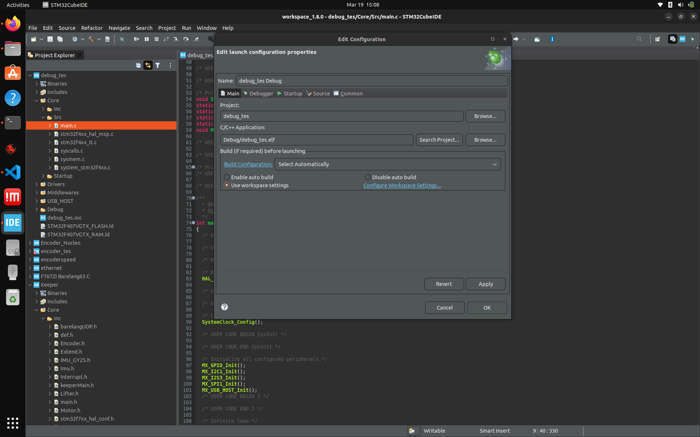
Jika cubeIDE nya meminta persetujuan pergantian perspective, tekan saja OK.
9. Lalu klik "Live Expression" (berlogo kacamata berwarna hitam), lalu masukkan variable yang ingin kita baca, seperti contoh disini kita ingin membaca "tes".
klik "Add new expression", dan masukkan nama variablenya
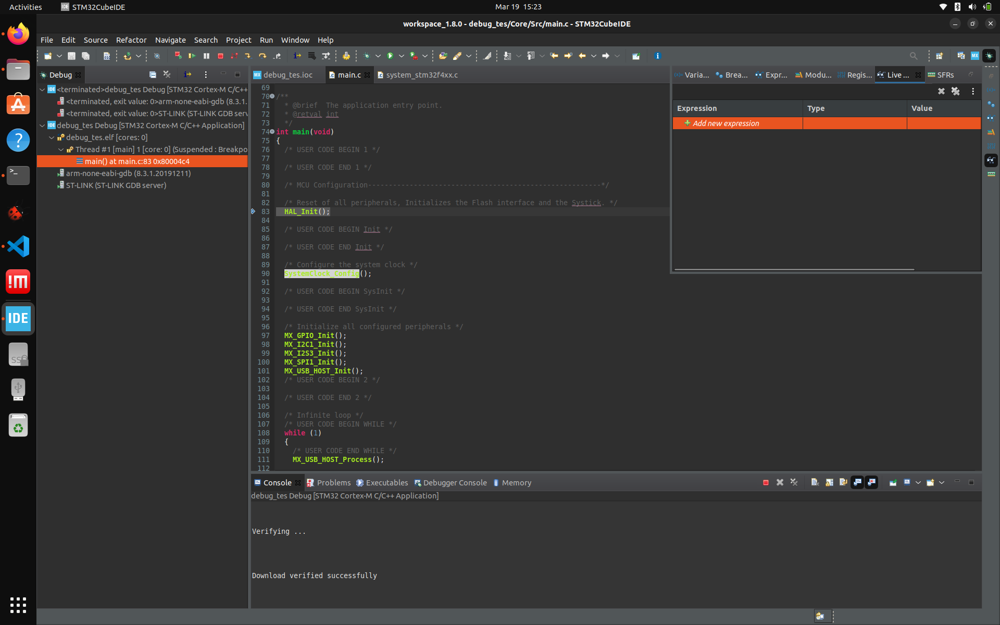
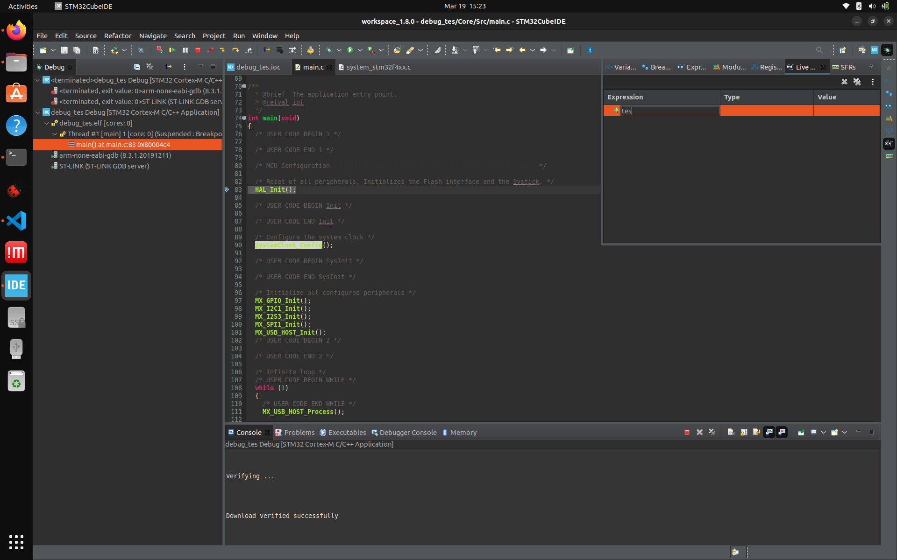
tekan enter
10. Kemudian tekan "resume" atau tekan tombol f8, lalu lihat perubahan value data "tes" sambil kamu menekan pushbuttonnya
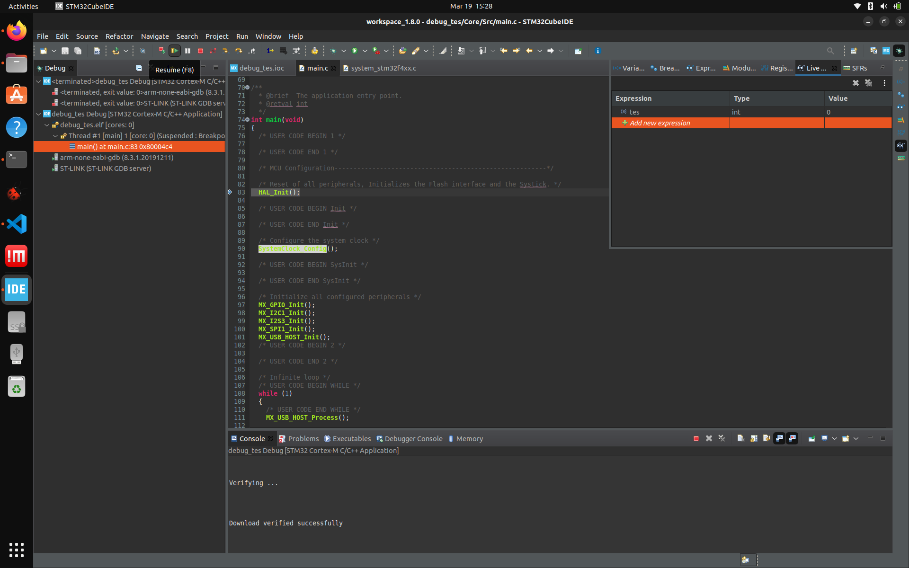
jika tombol tidak ditekan

jika tombol ditekan
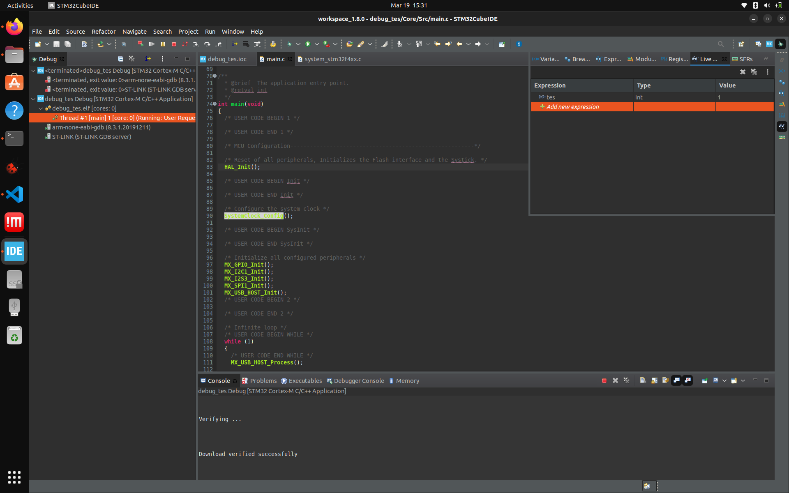

Nah sekarang cobalah menggunakan pushbutton/sensor dari external (luar board)!
