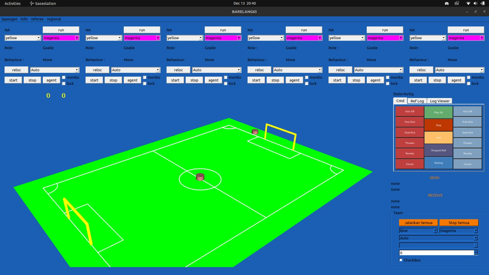

# Install Basestation

## Apa itu Basestation?
Basestation adalah aplikasi yang biasanya digunakan untuk memonitor/memberi perintah kepada robot pada saat pertandingan.

## Requirement
Ada beberapa library yang diperlukan untuk membuat Basestation:

- **QT5 / QT6**
- **VTK 9.* dengan dukungan QT yang diaktifkan**
- **[Rtbd2](../INSTALL/rtdb2_build.md)**

### Cara Build VTK 9.*
1. Salin folder VTK 9.* dari hardisk Barelang 63.
2. Ekstrak file tar VTK 9.*.
3. Masuk ke direktori VTK 9.*:
   ```sh
   mkdir build 
   cd build
   cmake .. -DVTK_GROUP_ENABLE_Qt=WANT -DVTK_QT_VERSION=5
   make -j$(nproc)
   sudo make install
   ```

### Cara Build Basestation
1. Salin folder Basestation dari hardisk Barelang 63.
2. Masuk ke direktori Basestation dan buat folder build:
   ```sh
   mkdir build
   cd build
   ```
3. Atur variabel lingkungan:
   ```sh
   export CMAKE_PREFIX_PATH="/path_to_qt"
   export LD_LIBRARY_PATH=${LD_LIBRARY_PATH}:/path_to_qt:/path_to_vtk
   ```
4. Jalankan perintah build:
   ```sh
   cmake ..
   make
   ```

## Menjalankan Basestation
Jalankan aplikasi Basestation dengan perintah berikut:
```sh
./basestation
```

Tampilan Basestation setelah dijalankan:

