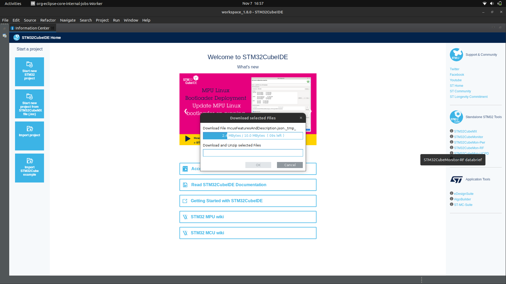

# Install STM32CubeIDE

## Copy/download installer STM32CubeIDE, ada 2 sumber :

1. Dari hdd barelang63 dengan nama file "en.st-stm32cubeide_1.8.0_11526_20211125_0815_amd64.deb_bundle.sh.zip"
2. Download dari link drive : [Link](https://drive.google.com/drive/folders/1uqQsptqDFMDDCNksKwA7uw0IZHHj666A?usp=sharing)

Jangan gunakan versi lain.

## Ekstrak file zip STM32CubeIDE

Lalu, didalam folder yang telah diekstrak, berikan izin akses pada file .sh nya dengan command :

```{ .sh .copy }
chmod +x st-stm32cubeide_1.8.0_11526_20211125_0815_amd64.deb_bundle.sh/
```

lalu, install dengan command :

```{ .sh .copy }
sudo ./st-stm32cubeide_1.8.0_11526_20211125_0815_amd64.deb_bundle.sh/
```

lalu accept semua license dengan mengetik y pada terminal lalu tekan enter.

untuk meng-skip text license nya tekan 'q'

lalu tunggu hingga proses instalasi selesai.

## Buka aplikasi STM32CubeIDE pada application

1. Pilih lokasi workspace yang diinginkan, lalu klik "launch"


2. Untuk meng-install board yang diinginkan, buat projek baru dengan mengklik "Start new STM32 project". tunggu proses download selesai.


3. Lalu pilih board yang akan digunakan, sebagai contoh disini kita akan menggunakan board "Nucleo-F767ZI". klik "Board Selector", lalu cari nama board nya pada "Commercial Part Number", klik board nya, lalu teken next.
  

4. Masukkan project name yang diinginkan, pilih bahasa program yang diinginkan lalu klik finish.
 
Jika sebelumnya belum pernah membuat program STM dengan board yang dipilih, maka aplikasi akan otomatis mendownload software packages yang dibutuhkan.
 