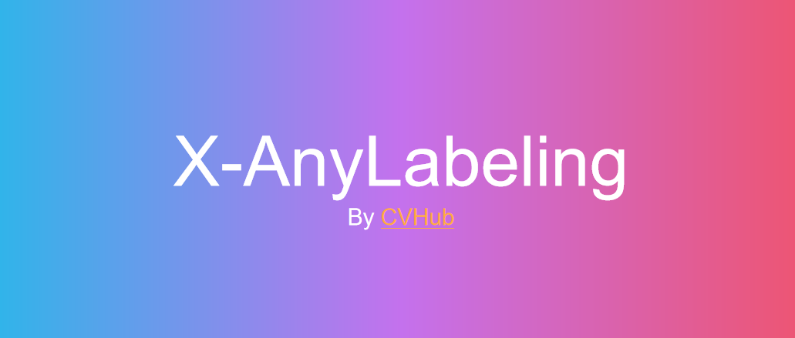

# **X-Anylabeling: Alat Anotasi Dataset dengan Fitur Auto Labeling**



## Instalasi dan Penggunaan

[X-Anylabeling](https://github.com/CVHub520/X-AnyLabeling/tree/main) adalah alat anotasi dataset yang dilengkapi dengan AI engine untuk mempermudah dan mempercepat proses anotasi. X-Anylabeling mendukung berbagai format model seperti YOLO, YOLO-OBB, YOLO Instance Segmentation, VOC, COCO, dan lainnya.

Dokumentasi X-Anylabeling sudah lengkap, termasuk panduan instalasi dan penggunaan. Anda dapat langsung mengikuti petunjuk yang tersedia di repositorinya tanpa perlu panduan tambahan langkah demi langkah.

* 🔧 [Panduan Instalasi](https://github.com/CVHub520/X-AnyLabeling/blob/main/docs/en/get_started.md)

* 🚀 [Panduan Penggunaan](https://github.com/CVHub520/X-AnyLabeling/blob/main/docs/en/user_guide.md)

## Auto Label dengan Model Predefined
X-Anylabeling menyediakan beberapa model predefined yang dapat diunduh dan langsung digunakan untuk melakukan anotasi otomatis. Beberapa contoh model yang tersedia antara lain YOLO, GroundingDINO, GroundingSAM, DepthAnything, dan lainnya. 

Berikut demo penggunaannya:


## Auto Label dengan Custom Model
Selain menggunakan model predefined, Anda juga dapat menggunakan custom model yang sebelumnya telah Anda latih sendiri. Untuk menggunakan custom model pada fitur auto label di X-Anylabeling, terdapat beberapa langkah persiapan yang perlu dilakukan:
### 1. Konversi Model ke Format ONNX  
X-Anylabeling hanya mendukung model dalam format ONNX. Jadi, jika Anda memiliki model dalam format lain (misalnya ``.pt`` untuk model YOLO), Anda perlu mengonversinya terlebih dahulu ke format ONNX. Anda dapat merujuk ke dokumentasi berikut untuk melakukan konversi: 

👉 ["YOLO Training Custom Dataset"](yolo_custom_dataset.md).

### 2. Buat file YAML 
Anda perlu membuat file ``.yaml`` untuk mendeskripsikan model Anda. File ini dapat disesuaikan berdasarkan jenis dan struktur model yang digunakan. Sebagai referensi, Anda dapat melihat contoh-contoh konfigurasi pada dokumentasi berikut: 

👉 ["Model Zoo"](https://github.com/CVHub520/X-AnyLabeling/blob/main/docs/en/model_zoo.md). 

Berikut adalah contoh file YAML untuk model object detection YOLOv11:
```
type: yolo11
name: yolo11s-r20240930
display_name: Zed_Obs Model
model_path: E:\projects\dataset\zed_obs\custom_model\zed_obs.onnx
nms_threshold: 0.45
confidence_threshold: 0.25
classes:
  - Ball
  - Obstacle
```

* ``display_name`` dapat Anda isi sesuai nama yang diinginkan untuk ditampilkan.

* ``model_path`` adalah path lokal menuju file model ``.onnx``Anda.

* ``classes`` disesuaikan dengan label kelas yang digunakan pada saat pelatihan model.

### 3. Memuat Custom Model ke X-Anylabeling
Untuk menggunakan custom model yang telah dikonfigurasi:

* Buka X-Anylabeling.

* Pada opsi pemilihan model AI, pilih "Load Custom Model".

* Arahkan ke file ``.yaml`` yang sudah Anda buat dan pilih file tersebut.

* Model akan dimuat dan siap digunakan untuk proses auto label.

berikut demo penggunaannya:


