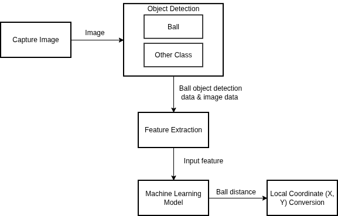
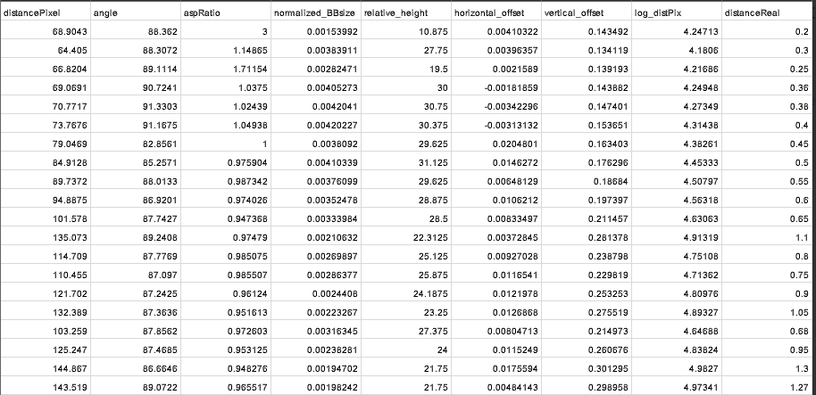

# **Ball Distance Estimation on Omnidirectional Camera**

Pada implementasi sistem saat dokumentasi ini ditulis (Oktober 2025), estimasi jarak bola pada kamera omnidirectional dilakukan menggunakan model machine learning. Dari berbagai model yang telah diuji, Multilayer Perceptron (MLP) menunjukkan performa terbaik.

Proses estimasi jarak menggunakan kamera omnidirectional dapat diilustrasikan pada gambar di bawah ini:



Seperti terlihat pada gambar di atas, model regresi menerima fitur hasil ekstraksi (feature extraction) yang diperoleh dari proses deteksi objek.
Hingga saat ini, fitur yang diekstraksi meliputi nilai dari bounding box bola yang terdeteksi, serta panjang dan lebar frame gambar dari kamera omnidirectional.

Contoh kode untuk perhitungan fitur-fitur tersebut adalah sebagai berikut:
```cpp
double distPix = sqrt(pow(poseX_ball - image_center_x, 2) + pow(poseY_ball - image_center_x, 2));
double BBSize = (box.right - box.left) * (box.bottom - box.top);
double aspRatio = width / height;
double relative_height = height;
double normalized_BBSize = BBSize / (image_height * image_width);
double horizontal_offset = (poseX_ball - image_center_x) / image_width;
double vertical_offset = (poseY_ball - image_center_y) / image_height;
double log_distPix = std::log(1.0f +distPix);
```

> 📌 `poseX_ball` dan `poseY_ball` adalah koordinat bola pada frame, yang dapat diperoleh dari titik tengah bounding box.    
> 📌 `width` dan `height` merupakan lebar dan tinggi bounding box.    
> 📌 `image_center_x` dan `image_center_y` adalah koordinat titik tengah frame dari kamera omnidirectional.   

## Dataset untuk Training Model Regresi

Berdasarkan fitur-fitur di atas, dapat dikumpulkan dataset yang digunakan untuk melakukan training model regresi.
Contoh bentuk dataset tersebut dapat dilihat pada gambar berikut:



Seperti terlihat pada tabel di atas:

> 📌 Kolom `distanceReal` merupakan nilai output (jarak sebenarnya yang ingin diprediksi).   
> 📌 Kolom-kolom lainnya merupakan fitur input yang digunakan oleh model regresi untuk melakukan estimasi jarak bola.

## Training Model Regresi
Untuk melakukan training model regresi, langkah pertama yang perlu dilakukan adalah menyiapkan dataset seperti yang telah dijelaskan sebelumnya.
Selanjutnya, proses pelatihan model MLP untuk regresi dapat mengikuti panduan yang terdapat pada repositori berikut:

👉 [Barelang63-KRSBI-Beroda / MLP_for_Regression](https://github.com/Barelang63-KRSBI-Beroda/MLP_for_Regression.git)

Proses training tersebut akan menghasilkan beberapa file model hasil pelatihan.
Pada implementasi di robot Barelang63, model yang digunakan memiliki format `.onnx`, yang memungkinkan integrasi mudah ke dalam sistem berbasis C++ untuk inferensi real-time.

## video implementasi
Berikut merupakan tampilan hasil penerapan estimasi jarak bola menggunakan model machine learning ini:

<p align="center">
  <a href="https://youtu.be/tBVEI3aYfY4">
    
  </a>
</p>


