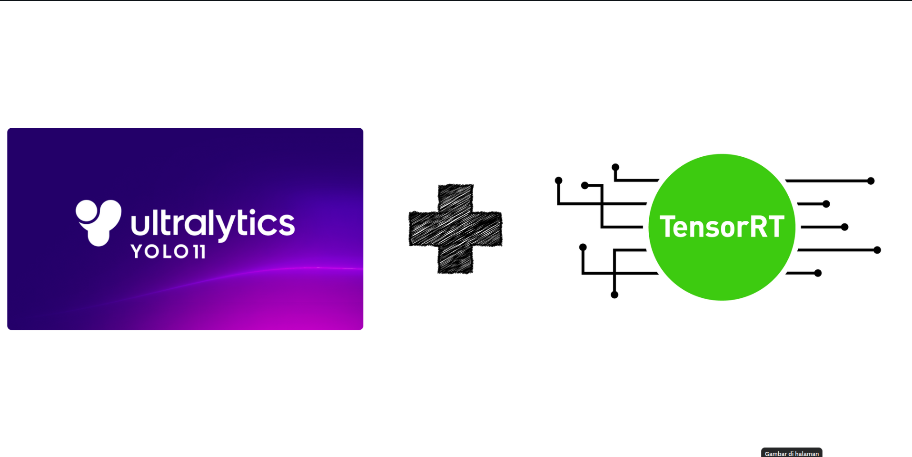
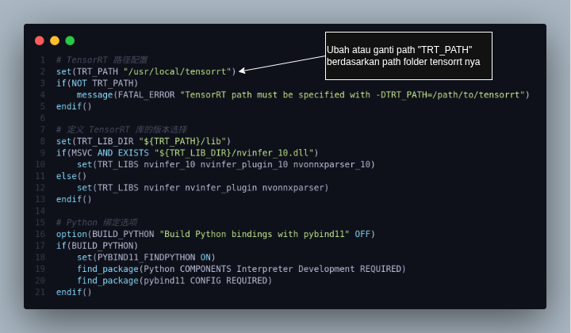
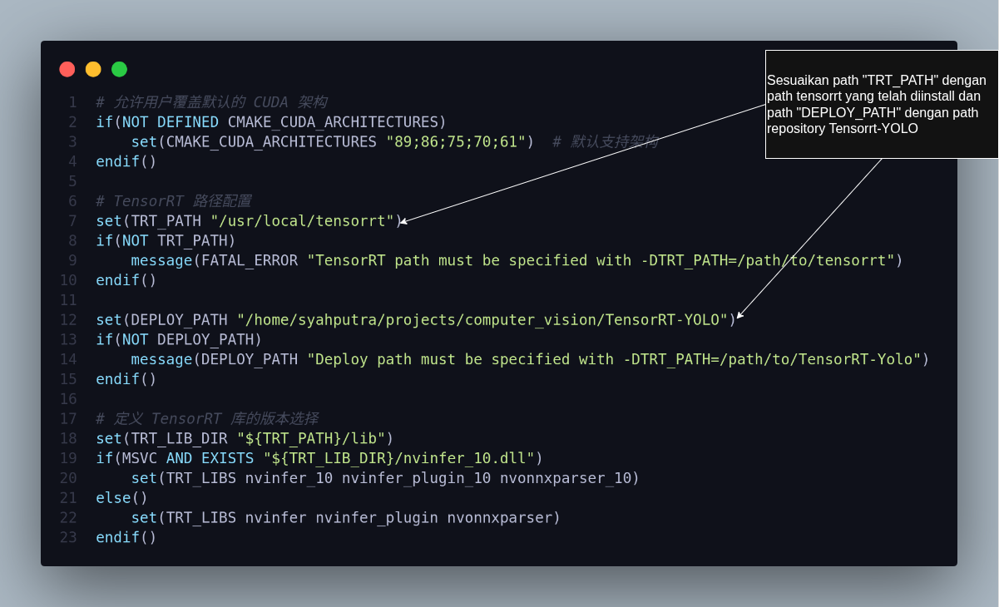
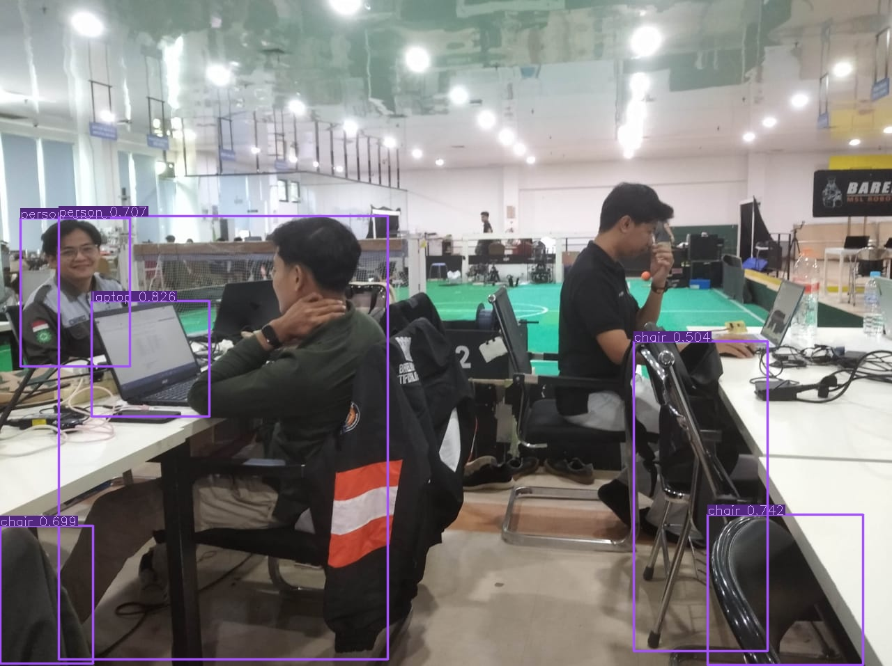

# **YOLO11 + TensorRT: Optimasi Model YOLO11 dengan TensorRT di GPU NVIDIA**



TensorRT adalah framework dari NVIDIA yang dirancang khusus untuk mempercepat dan mengoptimalkan inferensi model deep learning di GPU NVIDIA. Dengan TensorRT, model YOLO dapat berjalan lebih **cepat, ringan, dan efisien**.  

> 📌 Kalau Anda ingin melakukan **training custom YOLO11**, silakan cek dokumentasi berikut: 👉 [YOLO Custom Model](yolo_custom_dataset.md).  
> 📌 Untuk inferensi dengan **Python**, Anda bisa ikuti panduan resmi Ultralytics di sini: 👉 [Ultralytics - TensorRT Integration](https://docs.ultralytics.com/integrations/tensorrt/).

---

## 🛠️ Build Repository `TensorRT-YOLO` untuk Inferensi YOLO11 (C++)

Dokumentasi ini fokus pada implementasi inferensi **YOLO11 + TensorRT** menggunakan bahasa **C++**. Kita akan menggunakan repository berikut sebagai referensi utama:  

👉 [https://github.com/laugh12321/TensorRT-YOLO.git](https://github.com/laugh12321/TensorRT-YOLO.git)

Sebelum bisa build project ini, pastikan TensorRT sudah terinstal. Berikut langkah instalasinya:

---

### ✅ Instalasi TensorRT

#### 1. Unduh TensorRT
Download dari situs resmi NVIDIA:  
👉 [https://developer.nvidia.com/tensorrt/download](https://developer.nvidia.com/tensorrt/download)

Disarankan pilih file berformat `.tar` karena lebih mudah dipasang.

#### 2. Ekstrak dan Pindahkan Folder
Ekstrak file `.tar`, lalu rename folder hasil ekstraksi jadi lebih simpel, misalnya `tensorrt`.  
Pindahkan ke `/usr/local`:
```bash
sudo mv tensorrt /usr/local
```

#### 3. Salin File `trtexec`
Di dalam `tensorrt/bin` ada file penting bernama `trtexec`. Supaya bisa dipanggil langsung lewat terminal, copy ke `/usr/bin`:
```bash
cd /usr/local/tensorrt/bin
sudo cp trtexec /usr/bin
```

#### 4. Tambahkan Path Library ke Environment
Tambahkan ke `~/.bashrc`:
```bash
export LD_LIBRARY_PATH=/usr/local/tensorrt/targets/x86_64-linux-gnu/lib:$LD_LIBRARY_PATH
```
Lalu jalankan:
```bash
source ~/.bashrc
```

🎉 TensorRT siap digunakan!

---

### ✅ Build Repository `TensorRT-YOLO`

Sebelum build, ada beberapa penyesuaian kecil:

#### 1. Edit File `CMakeLists.txt`
Buka file `CMakeLists.txt` di root repo, sesuaikan path TensorRT dengan lokasi instalasi Anda.  
Contoh tampilan bagian yang perlu diedit:  


#### 2. Tambahkan Path CUDA ke Environment
Tambahkan ke `~/.bashrc` (ganti versi sesuai CUDA di sistem Anda):
```bash
export PATH=/usr/local/cuda-12.6/bin:$PATH
export CUDACXX=/usr/local/cuda-12.6/bin/nvcc
export LD_LIBRARY_PATH=/usr/local/cuda-12.6/lib64:$LD_LIBRARY_PATH
```

#### 3. Build Proyek
Jalankan:
```bash
mkdir build
cd build
cmake ..
make
```

#### 4. Hasil Build: Folder `lib`
Setelah selesai, akan muncul folder `lib/` berisi:
```
└── lib/
     ├── libdeploy.so
     └── plugin/
              └── libcustom_plugins.so       
```

- **libdeploy.so** → library utama untuk inferensi YOLO dengan TensorRT  
- **libcustom_plugins.so** → plugin tambahan untuk fitur OBB, Pose, dan Segmentation  

---

## 🛠️ Build Examples di Repository `TensorRT-YOLO`

Repo ini menyediakan banyak contoh (examples), seperti:

- Object Detection  
- Oriented Bounding Box (OBB)  
- Pose Estimation  
- Instance Segmentation  

Di sini kita akan coba build example **Object Detection**.

---

### 🎯 Build Example: Object Detection

#### 1. Masuk ke Direktori `detect`
Struktur folder examples:
```
examples/
├── classify/
├── detect/
├── multi_thread/
├── obb/
├── pose/
├── segment/
└── Videopipe/
```
Masuk ke folder `detect`:
```bash
cd examples/detect
```

#### 2. Edit File `CMakeLists.txt`
Sesuaikan path TensorRT dan library hasil build sebelumnya.  
Contoh bagian yang perlu diedit:  


#### 3. Build Example
```bash
mkdir build
cd build
cmake ..
make
```
Hasilnya berupa file executable `detect` di folder `bin/`.

---

### 🔄 Konversi Model ke TensorRT `.engine`

YOLO biasanya masih dalam format `.pt` (PyTorch). Supaya bisa dipakai di TensorRT, perlu dikonversi:  
```
.pt → .onnx → .engine
```

1. Konversi `.pt` ke `.onnx` dengan Ultralytics atau package `tensorrt_yolo`:  
```bash
pip install -U tensorrt_yolo
trtyolo export -w models/yolo11n.pt -v yolo11 -o models -s
```

2. Konversi `.onnx` ke `.engine`:  
```bash
trtexec --onnx=models/yolo11n.onnx --saveEngine=models/yolo11n.engine --fp16
```

⏳ Proses ini mungkin butuh waktu, tergantung GPU Anda.

---

### ▶️ Jalankan Executable
Setelah punya file `.engine`, jalankan:
```bash
./detect -e ../models/yolo11n.engine -i ../images/testing.jpeg -o ../output -l ../labels.txt
```

- `-e` → path ke file `.engine`  
- `-i` → gambar input  
- `-o` → folder output  
- `-l` → file label kelas  

Contoh hasil inferensi:  


---

## 🔧 Tambahan

Untuk examples lain (OBB, Pose, Segmentation), langkah build sama. Bedanya, saat konversi ke `.engine` perlu tambahan argumen plugin:
```bash
trtexec --onnx=models/yolo11n-obb.onnx   --saveEngine=models/yolo11n-obb.engine   --fp16   --staticPlugins=/path/to/TensorRT-YOLO/lib/plugin/libcustom_plugins.so   --setPluginsToSerialize=/path/to/TensorRT-YOLO/lib/plugin/libcustom_plugins.so
```

📚 Info lengkap bisa dilihat langsung di repo:  
👉 [https://github.com/laugh12321/TensorRT-YOLO.git](https://github.com/laugh12321/TensorRT-YOLO.git)