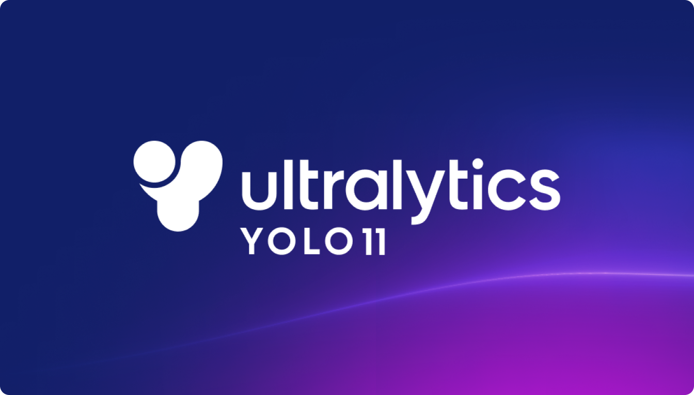
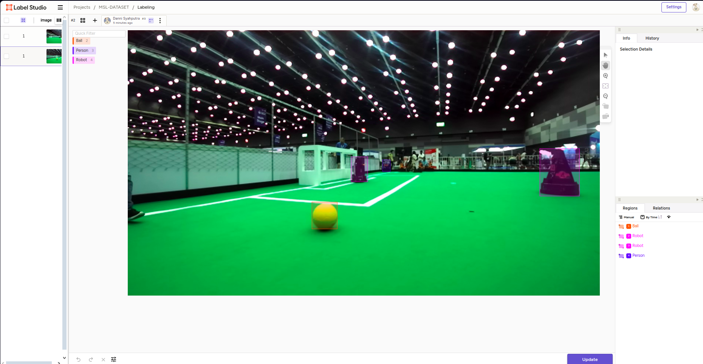
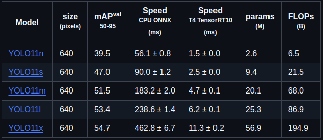
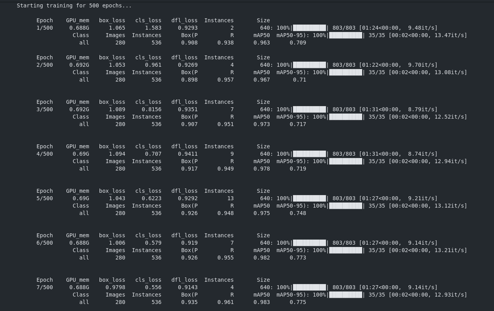

# Training Model YOLO11 pada Custom Dataset
YOLO (You Only Look Once) adalah salah satu algoritma dalam bidang computer vision yang digunakan untuk mendeteksi objek dalam gambar atau video secara real-time. Algoritma ini sangat populer karena kecepatan, efisiensi, dan kemampuannya untuk bekerja pada perangkat keras dengan spesifikasi terbatas.



Pada saat dokumentasi ini dibuat, versi terbaru dari YOLO adalah YOLO11. Berikut adalah langkah-langkah untuk melakukan training model YOLO11 menggunakan custom dataset:

## 1. Setup Environment
Dalam proses training, kita akan menggunakan bahasa pemrograman Python. Sangat disarankan untuk menggunakan virtual environment, seperti Anaconda atau Python Virtual Environment, untuk menghindari konflik antara package yang akan diinstal.

Agar proses training dataset lebih mudah, disarankan untuk menggunakan Jupyter Notebook atau dalam format .ipynb (IPython Notebook). Format ini memungkinkan Anda untuk menulis kode, menjalankannya, dan mendokumentasikan langkah-langkah dalam satu file yang terstruktur, memudahkan proses pengembangan dan analisis.

Berikut adalah beberapa package yang perlu diinstal untuk memulai training YOLO11:

- [PYTORCH](https://pytorch.org) - Framework utama untuk machine learning dan deep learning yang digunakan dalam pelatihan model YOLO. Disarankan untuk melakukan training di perangkat yang dilengkapi dengan GPU agar proses pelatihan berjalan lebih cepat dan efisien. Jika menggunakan GPU, pastikan untuk menginstal [CUDA](../INSTALL/cuda_and_cudnn.md) pada perangkat tersebut, kemudian instal versi PyTorch yang mendukung CUDA untuk memanfaatkan akselerasi GPU dalam pelatihan model.

- ULTRALYTICS - Library yang menyediakan implementasi dari YOLO. Anda dapat menginstalnya dengan menjalankan perintah berikut:
```{ .sh .copy }
!pip install ultralytics
```     

- OPENCV - Digunakan untuk memproses gambar dan video. Anda dapat menginstalnya dengan perintah berikut:
```{ .sh .copy }
!pip install opencv-python
```

## 2. Prepare Dataset
### a. Labeling Dataset
Sebelum melatih model, Anda perlu memberi label pada dataset gambar. Dalam format YOLO, setiap gambar disertai dengan file teks yang berisi anotasi objek yang terdapat dalam gambar tersebut. File teks ini mengikuti format tertentu. Untuk melabeli gambar, Anda dapat menggunakan beberapa tools yang mempermudah proses ini. seperti [LabelImg](https://github.com/HumanSignal/labelImg.git), [Label Studio](https://labelstud.io), ataupun [Roboflow](https://roboflow.com).



### b. Struktur Folder Dataset
Dataset perlu diorganisasi dengan cara yang sesuai dengan format YOLO. Berikut adalah struktur direktori yang disarankan untuk dataset yang akan ditrain:
```
dataset_example/
│
├── images/
│   ├── train/
│   │   ├── img001.jpg
│   │   ├── img002.jpg
│   │   └── ...
│   ├── val/
│       ├── img001.jpg
│       ├── img002.jpg
│       └── ... 
│        
├── labels/
│   ├── train/
│   │   ├── img001.txt
│   │   ├── img002.txt
│   │   └── ...
│   ├── val/
│       ├── img001.txt
│       ├── img002.txt
│	└── ...
│       
└── data.yaml
```
### c. Penjelasan Struktur Folder:
1. images/: Folder ini berisi gambar-gambar yang akan digunakan untuk pelatihan dan validasi.
    - train/: Gambar-gambar untuk training.
    - val/: Gambar-gambar untuk validation.
2. labels/: Folder ini berisi file anotasi untuk setiap gambar.
    - train/: Anotasi untuk gambar di folder train.
    - val/: Anotasi untuk gambar di folder val.
3. data.yaml: File konfigurasi yang mendeskripsikan kelas-kelas yang ada di dataset serta lokasi dataset gambar dan anotasi.

## 3. Training The Dataset
Setelah semua langkah di atas dilakukan, Anda dapat memulai proses pelatihan. Berikut adalah langkah-langkah yang dapat diikuti pada Jupyter Notebook atau file dengan format .ipynb.

### a. Import Libraries / Package.
Mulailah dengan mengimpor library yang dibutuhkan:
```{ .sh .copy }
import os
import cv2
from ultralytics import YOLO
```

### b. Define Dataset Paths
```{ .sh .copy }
# Define paths to your dataset
dataset_path = 'E:\Yolov11-custom-object-detection\dataset\omniku'

# Path to your data.yaml file
data_yaml_path = os.path.join(dataset_path, 'data.yaml')
```
sesuaikan "dataset_path" dengan Custom Dataset yang akan di training.

### c. Prepare Data YAML
```{ .sh .copy }
data_yaml_content = """
path: E:\Yolov11-custom-object-detection\dataset\omniku
train: E:\Yolov11-custom-object-detection\dataset\omniku\images\\train
val: E:\Yolov11-custom-object-detection\dataset\omniku\images\\val

nc: 1  # Number of classes in your dataset
names: ['Ball']  # List of class names in your dataset
"""

# Save data.yaml
with open(data_yaml_path, 'w') as file:
    file.write(data_yaml_content)
```
#### Penjelasan:
- path: Lokasi utama dari dataset, di mana folder images dan labels berada. Sesuaikan dengan path di sistem yang digunakan.

- train: Path menuju folder yang berisi gambar-gambar untuk pelatihan. Pastikan ini mengarah ke folder yang benar (images/train).

- val: Path menuju folder yang berisi gambar-gambar untuk validasi. Pastikan ini mengarah ke folder yang benar (images/val).

- nc: Jumlah kelas dalam dataset. Misalnya, jika dataset hanya memiliki satu kelas (misalnya "Ball"), set nc menjadi 1. Jika Anda memiliki lebih dari satu kelas, ganti angka ini sesuai jumlah kelas.

- names: Daftar nama kelas dalam dataset Anda. Gantilah ['Ball'] dengan nama-nama kelas yang ada dalam dataset Anda. Misalnya, jika dataset Anda memiliki dua kelas, ubah menjadi ['Ball', 'Player'].

### d. Load YOLOv11 Model
```{ .sh .copy }
# Load a YOLOv11 model (e.g., YOLO11n for small model)
model = YOLO('yolo11n.pt')
```
Berikut adalah beberapa pilihan model YOLO11 yang dapat dipilih berdasarkan ukuran dan kebutuhan Anda:


### e. Start The Training
Setelah model YOLOv11 dimuat dan file data.yaml disiapkan, proses training dapat dimulai dengan menentukan beberapa parameter pelatihan.
```{ .sh .copy }
train_params = {
    'data': data_yaml_path,      # Path to data.yaml
    'epochs': 500,               # Number of epochs
    'batch': 4,                  # Batch size
    'imgsz': 640,                # Image size
    'device': 'cuda',            # Use 'cuda' for GPU or 'cpu' for CPU
    'patience': 150              # Number of epochs with no improvement to wait before stopping
}

# Start training
model.train(**train_params)
```
Tunggu hingga proses training selesai berdasarkan parameter yang telah diatur.


Saat skrip training dijalankan di Jupyter Notebook atau platform lainnya, folder runs akan dibuat secara otomatis. Anda dapat memeriksa terminal atau output selama proses training untuk mengetahui di mana hasil training disimpan. Biasanya, hasil tersebut disimpan di direktori seperti runs/detect/train, di mana Anda dapat menemukan weights model, log, dan metrics.

### f. Exporting YOLOv11 Custom Model to ONNX Format
Karena inference pada robot menggunakan bahasa pemrograman C++, model yang telah dilatih perlu dikonversi ke format ONNX (Open Neural Network Exchange). ONNX adalah format standar yang digunakan untuk menyimpan model machine learning dan deep learning, sehingga dapat dijalankan di berbagai platform dan framework seperti TensorFlow, PyTorch, dan C++.
```{ .sh .copy }
model_custom = YOLO('runs/detect/train4/weights/best.pt')
model_custom.export(format='onnx')
```
Ganti path "model_custom" berdasarkan path model yang telah ditraining.

Dengan mengikuti langkah-langkah di atas, Anda dapat melatih model YOLOv11 dengan dataset custom dan mengekspor model yang dilatih ke dalam format ONNX untuk digunakan dalam aplikasi berbasis C++ pada robot atau perangkat lainnya.

